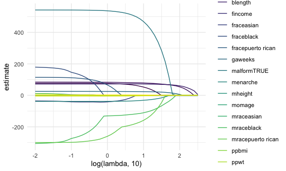
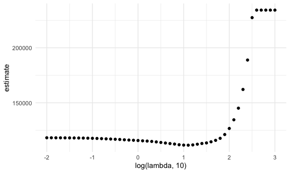
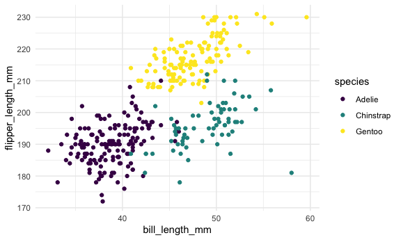
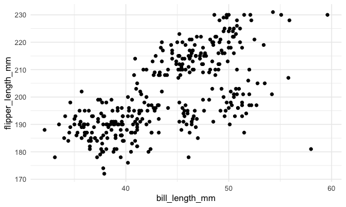
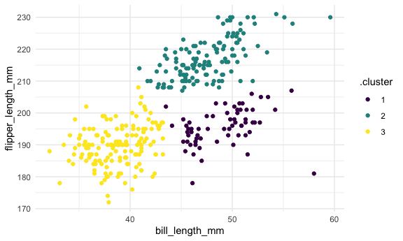

Statistical Learning
================

# Load packages and set seed

``` r
library(tidyverse)
library(glmnet)

set.seed(11)
```

# Lasso

``` r
bwt_df = 
  read_csv("data/birthweight.csv") |> 
  janitor::clean_names() |>
  mutate(
    babysex = as.factor(babysex),
    babysex = fct_recode(babysex, "male" = "1", "female" = "2"),
    frace = as.factor(frace),
    frace = fct_recode(
      frace, "white" = "1", "black" = "2", "asian" = "3", 
      "puerto rican" = "4", "other" = "8"),
    malform = as.logical(malform),
    mrace = as.factor(mrace),
    mrace = fct_recode(
      mrace, "white" = "1", "black" = "2", "asian" = "3", 
      "puerto rican" = "4")) |> 
  sample_n(200)
```

    ## Rows: 4342 Columns: 20
    ## ── Column specification ────────────────────────────────────────────────────────
    ## Delimiter: ","
    ## dbl (20): babysex, bhead, blength, bwt, delwt, fincome, frace, gaweeks, malf...
    ## 
    ## ℹ Use `spec()` to retrieve the full column specification for this data.
    ## ℹ Specify the column types or set `show_col_types = FALSE` to quiet this message.

get predictors and outcome instead of specifying the name of all the
variables we just want to provide the values to glmnet and tell glmnet
to put it all in there; so our design matrix will have the values of all
of the variables -1 is just us removing the first column intercept

``` r
x = model.matrix(bwt ~ ., bwt_df)[, -1]

y = bwt_df |> pull(bwt)
```

now we need to fit lasso creating grid of lambda values we’re specifying
lambdas but you don’t have to; glmnet has defaults

run lasso then run cross validation

``` r
lambda = 10^(seq(3, -2, -0.1))

lasso_fit <-
  glmnet(x, y, lambda = lambda)

lasso_cv <- 
  cv.glmnet(x, y, lambda = lambda)
```

let’s look at lasso results! at step 15 (lambda value of 39.8), these
are our variables and their estimates for each step see what’s showing
up in your model if categorical factor, the way we’re doing it now lasso
can say that some levels of a factor are important and some are not

``` r
lasso_fit |> 
  broom::tidy() |> 
  filter(step == 15)
```

    ## # A tibble: 9 × 5
    ##   term               step  estimate lambda dev.ratio
    ##   <chr>             <dbl>     <dbl>  <dbl>     <dbl>
    ## 1 (Intercept)          15 -3291.      39.8     0.581
    ## 2 bhead                15    69.6     39.8     0.581
    ## 3 blength              15    69.0     39.8     0.581
    ## 4 gaweeks              15    19.1     39.8     0.581
    ## 5 malformTRUE          15   213.      39.8     0.581
    ## 6 menarche             15    -9.60    39.8     0.581
    ## 7 mraceblack           15   -52.2     39.8     0.581
    ## 8 mracepuerto rican    15    -2.92    39.8     0.581
    ## 9 wtgain               15     0.400   39.8     0.581

let’s visualize! when i have missing lambda valye make estimate 0
(meaning that variable want’s included in that model) filling in
regression coefficients where they should be 0

``` r
lasso_fit |> 
  broom::tidy() |> 
  filter(term != "(Intercept)") |> 
  complete(term, lambda, fill = list(estimate = 0)) |> 
  ggplot(aes(x = log(lambda, 10), y = estimate, color = term, group = term)) +
  geom_path()
```


far left everything incuded in model; far right nothing included in
model, all coefficients go to zero

``` r
lambda_opt = lasso_cv$lambda.min
log(10, 10)
```

    ## [1] 1

``` r
lasso_fit |> 
  broom::tidy() |> 
  filter(lambda == 10)
```

    ## # A tibble: 12 × 5
    ##    term               step  estimate lambda dev.ratio
    ##    <chr>             <dbl>     <dbl>  <dbl>     <dbl>
    ##  1 (Intercept)          21 -3697.        10     0.629
    ##  2 babysexfemale        21    52.8       10     0.629
    ##  3 bhead                21    78.7       10     0.629
    ##  4 blength              21    72.1       10     0.629
    ##  5 fincome              21     0.285     10     0.629
    ##  6 gaweeks              21    23.4       10     0.629
    ##  7 malformTRUE          21   469.        10     0.629
    ##  8 menarche             21   -31.3       10     0.629
    ##  9 mraceblack           21  -111.        10     0.629
    ## 10 mracepuerto rican    21  -159.        10     0.629
    ## 11 smoken               21    -3.02      10     0.629
    ## 12 wtgain               21     2.51      10     0.629

Show CV results

``` r
lasso_cv |> 
  broom::tidy() |> 
  ggplot(aes(x = log(lambda, 10), y = estimate)) +
  geom_point()
```



# K-means clustering

``` r
library(palmerpenguins)

data("penguins")

penguins |> 
  ggplot(aes(x = bill_length_mm, y = flipper_length_mm, color = species)) +
  geom_point()
```

    ## Warning: Removed 2 rows containing missing values (`geom_point()`).



``` r
penguins |> 
  ggplot(aes(x = bill_length_mm, y = flipper_length_mm)) +
  geom_point()
```

    ## Warning: Removed 2 rows containing missing values (`geom_point()`).



can we recreate this via clustering?

``` r
penguins = penguins |> 
  select(species, bill_length_mm, flipper_length_mm) |> 
  drop_na()

kmeans_fit = penguins |> 
  select(-species) |>
  scale() |> 
  kmeans(centers = 3)

penguins |> 
  broom::augment(kmeans_fit, data = _)
```

    ## # A tibble: 342 × 4
    ##    species bill_length_mm flipper_length_mm .cluster
    ##    <fct>            <dbl>             <int> <fct>   
    ##  1 Adelie            39.1               181 3       
    ##  2 Adelie            39.5               186 3       
    ##  3 Adelie            40.3               195 3       
    ##  4 Adelie            36.7               193 3       
    ##  5 Adelie            39.3               190 3       
    ##  6 Adelie            38.9               181 3       
    ##  7 Adelie            39.2               195 3       
    ##  8 Adelie            34.1               193 3       
    ##  9 Adelie            42                 190 3       
    ## 10 Adelie            37.8               186 3       
    ## # ℹ 332 more rows

make it so it tells you want the cluster assignment was

``` r
penguins |> 
  broom::augment(kmeans_fit, data = _) |> 
  ggplot(aes(x = bill_length_mm, y = flipper_length_mm, color = .cluster)) +
  geom_point()
```


since we scaled scale(); grouping looks better
